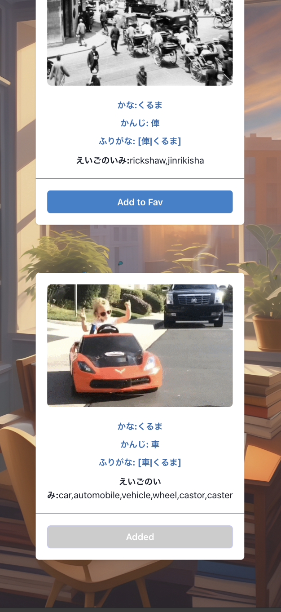

# Coming Soon..
https://search-your-word.onrender.com/

#  Search Your Word ~ Japanese-English Ver~ (with Quiz) 

## Introduction
This is a React based Japanese-English Dictionary (with Quiz), designed to support Japanese language learner and/or English language learner with quick, easier and fun way to support thier learning journey.
Same as the first project ([Guess the Word Game (Japanese Language Ver.)]:https://github.com/yuukka/guess-the-word-game) that I launched, the inspiration for creating this game came from my desire to help my son — who is primarily educated in English — to be able to search for words with fun GIF images to visulize to meaning of it.

 [Click Here To Start!]

[Click Here To Start!]: https://search-your-word.onrender.com

## Screenshots

### Search page
 

### Search Result 
 
 

### Saved Words (/Favlist)
 
 

### Quizs (/Quiz)
 

## Tech Stack & Resources
**Frontend Libraries:** 
* **Reach JS**
* **Chakra UI**

**Frontend:** 
* **HTML**
* **CSS** 
* **JavaScript** 

**Backend/Database:** 
* **Airtable**

**API:** 
* **[GIF]**
* **[Jotaba]**

**Image Resources:** 
* **[Kaggle]**
* **[Adobe Stock]**
* **[Figma]**

**Other Resources:** 
* **stackoverflow**
* **w3schools**
* **mdn**
* **excalidraw**

[GIF]: https://developers.giphy.com/

[Jotaba]: https://jotoba.de/

## Future Enhancements
* Improve UI (Top Page Layout, Menu, Quiz)
* Implement Quiz Logic (valiations of kanji vs Hiragana, randomization)

